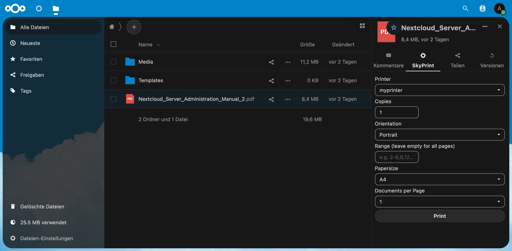

<!--

SPDX-FileCopyrightText: Christian Gessinger <christian@gessinger.de>

SPDX-License-Identifier: CC0-1.0

-->

# SkyPrint

This is the beta version of a new and improved nextcloud printing app. Please feel encouraged to report any bugs in the issues section of this repository.

## Progress
Note that some of these options need to be supported by your printer.
- Support for multiple printers
- Support for multiple copies of one document
- Support for media sizes: Letter, Legal and A4
- Support for orientations: Portrait, Landscape, Reverse Landscape and Reverse Portrait
- Support for specific pages and page-ranges
- Support for multiple documents on one page (N-Up printing)

## Missing features:
- Missing Advanced admin configuration
- Missing print preview
- Missing support for cups-pdf

## Basic Setup

1. Install required packages: `apt-get update && apt-get install cups cups-client cups-bsd`

2. Start cups service: `service cups start`

3. Configure cups printer using `lpadmin -p myprinter -v printer_uri` (documentation of lpadmin can be found [here](https://www.cups.org/doc/man-lpadmin.html))

4. Check configuration `lpstat -p -d`
